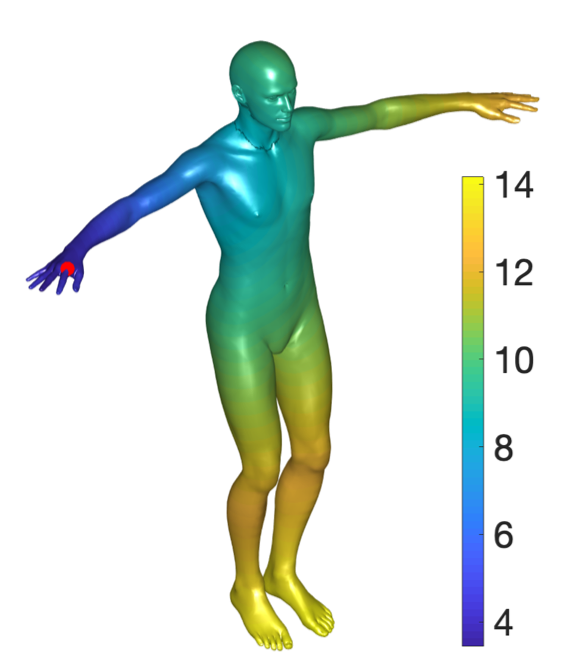

# Fast-Pairwise-Geodesic-Distance-Computation
[[Paper 1]](https://ieeexplore.ieee.org/abstract/document/8509134) [[Paper 2]](https://docs.wixstatic.com/ugd/28cd82_91f41197b793480ab25b1f97f10f818a.pdf)

Matlab code for a fast computation of pairwise geodesic distances on 3D triangle meshes, and on point clouds of any dimension.




## Setup & Usage
The project was tested on OSX with Matlab R2019a, and should work on windows 64 as well, to run it: 
1) Download files
2) Run DEMO_detailed.m


For your convenience, the code is also consiced in DEMO_only_code.m without the comments, visualizations, and options.

## Citation
If you use these ideas, please cite the papers (1) <a href="https://ieeexplore.ieee.org/abstract/document/8509134"> Efficient Inter-Geodesic Distance Computation and Fast Classical Scaling</a> and (2) <a href="https://docs.wixstatic.com/ugd/28cd82_91f41197b793480ab25b1f97f10f818a.pdf"> Accelerating the computation of canonical forms for 3D nonrigid objects using Multidimensional Scaling </a>:

```
@article{shamai2018efficient,
  title={Efficient Inter-Geodesic Distance Computation and Fast Classical Scaling},
  author={Shamai, Gil and Zibulevsky, Michael and Kimmel, Ron},
  journal={IEEE transactions on pattern analysis and machine intelligence},
  year={2018},
  publisher={IEEE}
}
```

```
@inproceedings{shamai2015accelerating,
  title={Accelerating the computation of canonical forms for 3D nonrigid objects using multidimensional scaling},
  author={Shamai, Gil and Zibulevsky, Michael and Kimmel, Ron},
  booktitle={Proceedings of the 2015 Eurographics Workshop on 3D Object Retrieval},
  pages={71--78},
  year={2015},
  organization={Eurographics Association}
}
```
